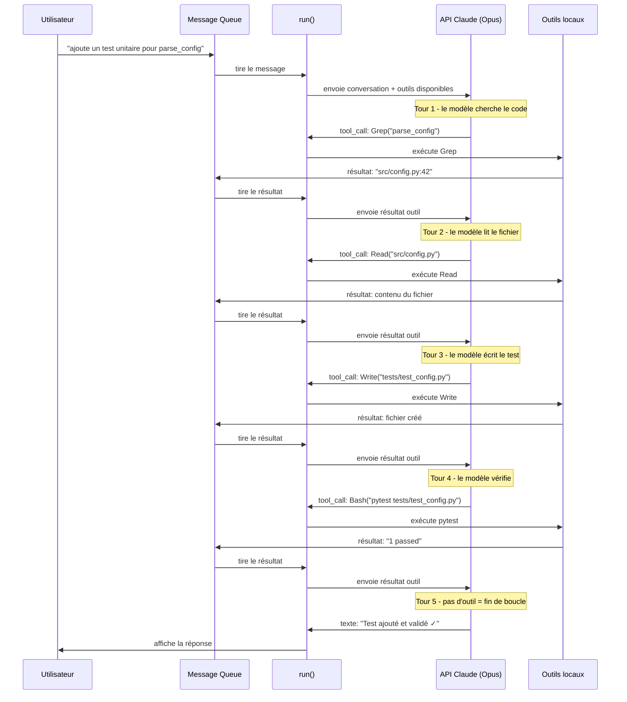
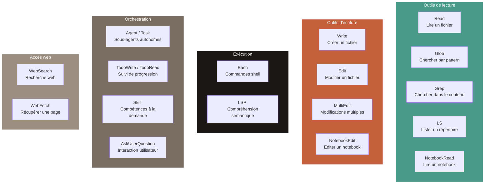
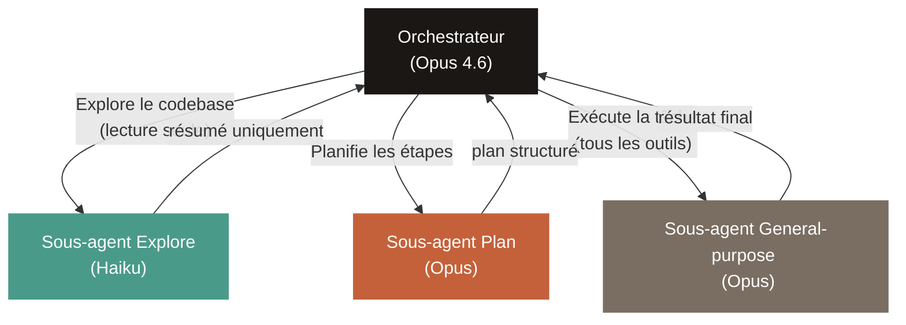
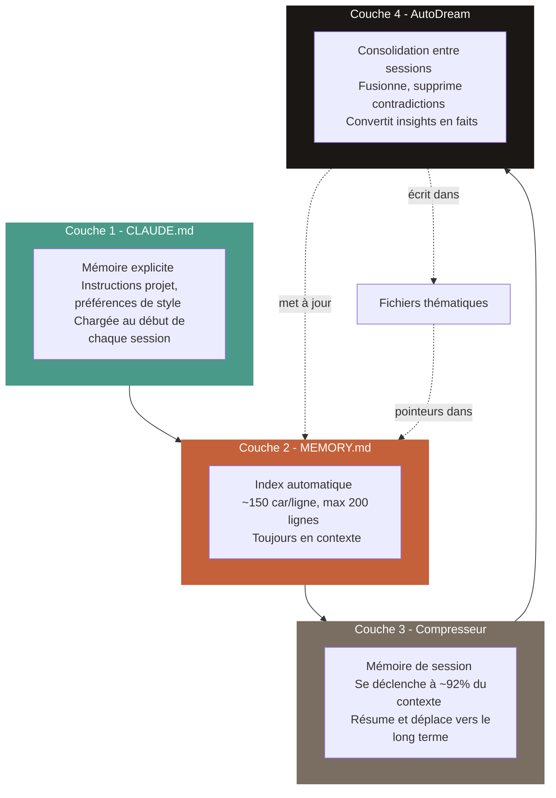
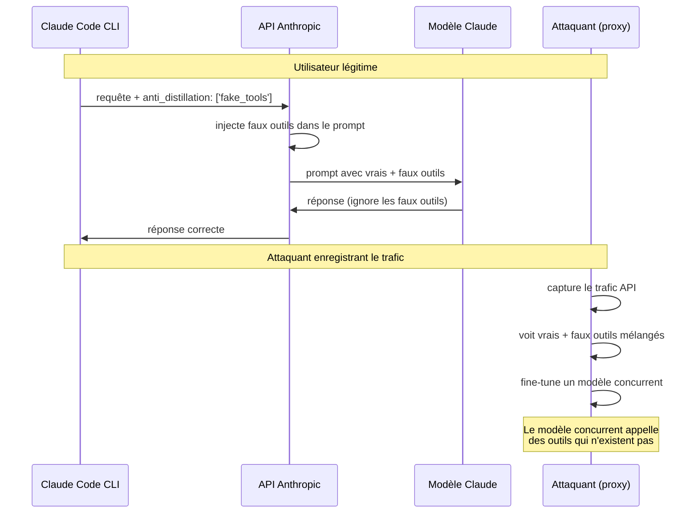
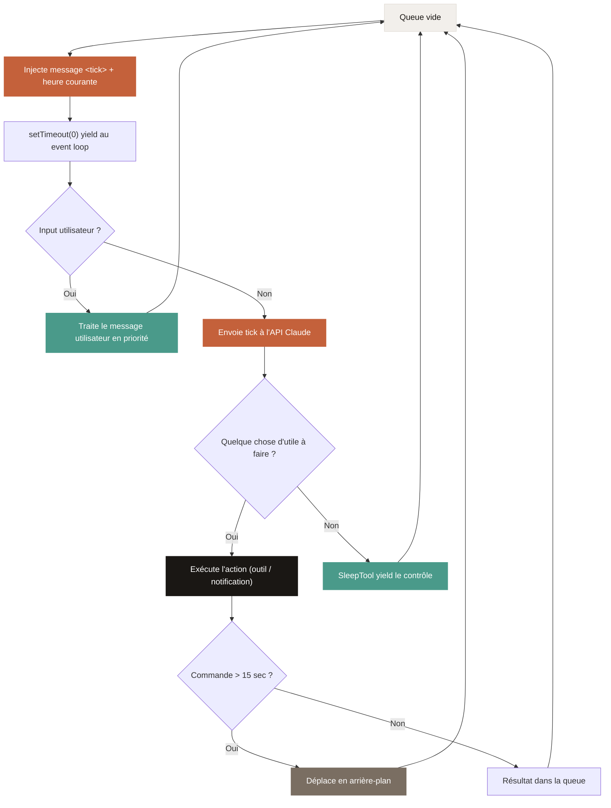

*Analyse technique basée exclusivement sur les sources ayant lu le code source réel (31 mars – 1er avril 2026)*

    

        <picture>
            <source media="(prefers-color-scheme: dark)" srcset="/assets/img/claude-code-leak/claude-code-flow-dark.svg">
            
        </picture>
    

    Du prompt à la réponse : architecture complète de Claude Code révélée par le leak du 31 mars 2026.

---

## 1. Le leak : 512 000 lignes de code exposées par accident

Le 31 mars 2026, aux alentours de 4h UTC, la version 2.1.88 du package npm `@anthropic-ai/claude-code` a été poussée sur le registre public avec un fichier que personne n'avait prévu d'inclure : un source map de 59,8 Mo contenant l'intégralité du code source de Claude Code - environ 512 000 lignes de TypeScript réparties sur quelque 1 900 fichiers *(VentureBeat, 31 mars 2026)*.

Vingt minutes plus tard, Chaofan Shou, un stagiaire chez Solayer Labs, repère l'anomalie et la signale sur X. Son post dépasse rapidement les 22 millions de vues *(CNBC, 31 mars 2026)*. En quelques heures, le code est mirroré sur GitHub, forké plus de 41 500 fois, et un clean-room rewrite atteint 50 000 stars en à peine deux heures - probablement le repo à la croissance la plus rapide de l'histoire de la plateforme *(Layer5, 1er avril 2026)*.

Anthropic confirme l'incident dans un communiqué envoyé à plusieurs médias : aucune donnée client ou credential n'a été exposée, et la fuite est attribuée à une erreur humaine de packaging, pas à une faille de sécurité *(CNBC, 31 mars 2026)*.

Pour Anthropic, une entreprise valorisée à environ 380 milliards de dollars avec un revenu annualisé de 19 milliards - dont 2,5 milliards pour Claude Code seul - l'incident dépasse le simple embarras technique *(VentureBeat, 31 mars 2026)*.

---

## 2. Comment le leak s'est produit

L'explication technique est d'une simplicité déconcertante. Claude Code est construit sur Bun, le runtime JavaScript qu'Anthropic a acquis fin 2025. Or Bun génère des fichiers source map par défaut lors du bundling. Ces fichiers, normalement réservés au débogage, contiennent le code source original en clair à l'intérieur d'un simple champ JSON appelé `sourcesContent` *(Kuberwastaken, 31 mars 2026)*.

L'erreur : personne n'a ajouté `*.map` au fichier `.npmignore`, ni configuré le bundler pour désactiver la génération de source maps en production. Un bug Bun documenté le 11 mars - vingt jours avant le leak - signalait justement que les source maps étaient servies en mode production malgré ce que la documentation promettait. Le bug était encore ouvert au moment de l'incident *(Alex Kim, 31 mars 2026)*.

L'ironie n'échappe à personne : le code contient un sous-système entier appelé "Undercover Mode", conçu spécifiquement pour empêcher les informations internes d'Anthropic de fuiter dans des commits publics. Le fichier `undercover.ts`, environ 90 lignes, interdit au modèle de mentionner des noms de code internes, des canaux Slack, ou même la phrase "Claude Code" quand il opère sur des dépôts open source. Un commentaire en ligne 15 précise qu'il n'existe aucun moyen de désactiver cette protection *(Alex Kim, 31 mars 2026)*. Et pourtant, c'est l'intégralité du système - Undercover Mode compris - qui s'est retrouvée en clair sur npm.

---

## 3. La boucle agentique : le cœur de l'architecture

### Un single-thread volontairement simple

La première surprise pour quiconque lit le code : Claude Code n'est pas le système multi-agents sophistiqué qu'on pourrait imaginer. C'est un processus Node.js mono-thread qui tourne localement sur la machine de l'utilisateur, organisé autour d'une boucle d'une simplicité radicale *(CodePointer/Substack, 31 mars 2026)*.

Le fonctionnement repose sur une file de messages (message queue). Quand l'utilisateur tape un message, il entre dans cette queue. Quand un outil finit de s'exécuter, son résultat entre dans la même queue. Une fonction `run()` tire les messages, les envoie à l'API Claude, et traite la réponse. Si la réponse contient des appels d'outils, les outils sont exécutés et leurs résultats réalimentent la queue. Quand le modèle répond en texte pur sans demander d'outil, la boucle s'arrête et attend le prochain input *(CodePointer/Substack, 31 mars 2026)*.

Anthropic a délibérément choisi cette architecture single-threaded pour la débuggabilité et la fiabilité. Pas de swarm d'agents concurrents, pas de personas multiples en compétition : un seul fil de messages plat *(Sebastian Raschka, 31 mars 2026)*.

Voici un exemple concret d'aller-retour avec le LLM. L'utilisateur demande *"ajoute un test unitaire pour la fonction parse_config"* :

### Trois phases qui se mélangent

Le cycle de travail se décompose en trois phases qui, en pratique, ne sont pas séquentielles mais se chevauchent : la collecte de contexte (recherche de fichiers, lecture du code), la prise d'action (édition, exécution de commandes), et la vérification des résultats (tests, linting). Claude utilise les outils tout au long de ces phases ; la boucle s'adapte à la demande.

---

## 4. Les outils : ce qui transforme un LLM en agent

Sans outils, Claude ne peut que répondre en texte. Les outils sont le mécanisme qui le rend agentique. Le code révèle plus de 40 outils intégrés, bien au-delà de ce qui était publiquement documenté *(Kuberwastaken, 31 mars 2026)*.

### Outils de lecture

Le code fournit à Claude des outils dédiés pour lire des fichiers (`Read`), découvrir des fichiers par pattern (`Glob`), rechercher du contenu dans le code (`Grep`), lister des répertoires (`LS`), et lire des notebooks Jupyter (`NotebookRead`). Le prompt système insiste : Claude doit préférer l'outil `Grep` plutôt que d'exécuter `grep` ou `rg` via Bash, et `Glob` plutôt que `find` ou `ls` *(Alex Kim, 31 mars 2026)*.

### Outils d'écriture

Pour modifier le code, Claude dispose de `Write` (créer un fichier), `Edit` (modifier un fichier existant avec remplacement ciblé), `MultiEdit` (modifications multiples en un appel), et `NotebookEdit` pour les notebooks Jupyter.

### L'outil Bash : le "joyau de la couronne"

L'outil `Bash` permet d'exécuter n'importe quelle commande shell - git, npm, docker, pytest. C'est l'outil le plus puissant mais aussi le plus contraint. Le prompt système est explicite : Bash doit être réservé aux vraies commandes système. Pour communiquer avec l'utilisateur, il faut utiliser le texte direct. Pour chercher, il faut utiliser Grep. Pour éditer, il faut utiliser Edit *(Alex Kim, 31 mars 2026)*.

### Outils d'orchestration

L'outil `Task` (ou `Agent`) permet de lancer des sous-agents autonomes. `TodoWrite` et `TodoRead` gèrent des listes de tâches structurées pour le suivi de progression. `AskUserQuestion` pose des questions à l'utilisateur avec possibilité de prévisualisation HTML. `Skill` invoque des compétences chargées à la demande. `WebSearch` et `WebFetch` permettent d'accéder au web *(Kuberwastaken, 31 mars 2026)*.

### Pourquoi des outils dédiés plutôt que tout via Bash ?

La philosophie est claire dans le code : les outils dédiés offrent un meilleur contrôle des permissions, une collecte de résultats plus fiable, et un meilleur suivi. Un outil LSP (Language Server Protocol) est aussi présent pour la hiérarchie d'appels et la recherche de références - ce qui donne à Claude Code une compréhension sémantique du code, pas simplement textuelle *(Sebastian Raschka, 31 mars 2026)*.

---

## 5. Les sous-agents : diviser pour régner

### Le modèle orchestrateur / travailleurs

Claude Code utilise un modèle hub-and-spoke : un agent principal (l'orchestrateur) qui délègue des tâches à des sous-agents spécialisés. Chaque sous-agent démarre avec une conversation fraîche - il ne voit pas l'historique du parent, charge son propre prompt système, et seule sa réponse finale remonte au parent comme résultat d'outil. Le contexte principal ne grossit que de ce résumé, pas de la transcription complète du sous-agent *(CodePointer/Substack, 31 mars 2026)*.

### Trois types de sous-agents intégrés

Le sous-agent **Explore** est en lecture seule : il n'a pas accès aux outils d'édition comme `Edit` ou `Write`. Il est conçu pour explorer le codebase sans risque de modification accidentelle, et utilise le modèle léger Haiku pour réduire les coûts. Le prompt système précise que toute exploration qui n'est pas une recherche ciblée d'un fichier spécifique doit passer par un sous-agent Explore plutôt que par des commandes de recherche directes *(Kuberwastaken, 31 mars 2026)*.

Le sous-agent **Plan** reçoit un prompt enrichi pour décomposer des tâches complexes en étapes. Il dispose d'un outil spécial `exit_plan_mode` pour signaler la fin de la planification.

Le sous-agent **General-purpose** a accès à tous les outils et peut gérer des tâches complexes multi-étapes incluant la recherche web, les modifications de fichiers et l'exécution de commandes.

Le contexte principal ne grossit que du résumé renvoyé par chaque sous-agent, pas de leur transcription complète. C'est ainsi que Claude Code maintient une fenêtre de contexte maîtrisée même sur des tâches longues.

### L'orchestration par prompt, pas par code

Un des détails les plus révélateurs du leak : l'algorithme d'orchestration multi-agents dans `coordinatorMode.ts` n'est pas du code procédural - c'est un prompt. L'orchestrateur gère ses agents workers via des instructions en langage naturel dans le prompt système, incluant des directives comme "ne pas valider du travail médiocre" et "comprendre les résultats avant de diriger le travail de suivi - ne jamais déléguer la compréhension elle-même à un autre worker" *(Alex Kim, 31 mars 2026)*.

### Plusieurs modèles LLM travaillent ensemble

Le code confirme que Claude Code n'utilise pas un seul modèle mais fait appel à différents LLM selon la tâche. L'agent principal (raisonnement complexe, décisions) utilise Opus, le modèle le plus puissant. Les sous-agents d'exploration et les métadonnées (titre de conversation, sujet) sont traités par Haiku, le modèle le plus léger et le moins coûteux. Le code référence aussi un mode ULTRAPLAN qui délègue une tâche de planification complexe à une session distante tournant sur Opus avec jusqu'à 30 minutes de réflexion *(Kuberwastaken, 31 mars 2026)*.

---

## 6. Le système de mémoire : quatre couches cognitives

VentureBeat identifie le système de mémoire comme la trouvaille la plus significative pour les concurrents. La façon dont Anthropic résout l'"entropie de contexte" - la tendance des agents à devenir confus sur de longues sessions - repose sur une architecture à quatre couches *(VentureBeat, 31 mars 2026)*.

### Couche 1 : CLAUDE.md - la mémoire explicite

Un fichier Markdown écrit par l'utilisateur ou généré automatiquement. Il contient les instructions projet : commandes de build, préférences de style, décisions architecturales. Ce fichier est chargé au début de chaque session avec le contexte projet (branche git, commits récents). Ses sections statiques sont globalement cachées pour éviter d'être recalculées à chaque tour - un marqueur de frontière sépare le contenu statique du contenu dynamique *(Sebastian Raschka, 31 mars 2026)*.

Un détail notable : le code instruit l'agent de traiter sa propre mémoire comme un "indice" et non une vérité absolue. Le modèle doit vérifier les faits contre le codebase réel avant de procéder *(VentureBeat, 31 mars 2026)*.

### Couche 2 : MEMORY.md - l'index automatique

Un index léger de pointeurs, environ 150 caractères par ligne, perpétuellement chargé dans le contexte. Le code révèle une contrainte importante : seules les 200 premières lignes sont chargées. Au-delà, le contenu est tronqué. Les notes détaillées sont déplacées dans des fichiers thématiques séparés, avec seulement des pointeurs dans l'index principal *(VentureBeat, 31 mars 2026)*.

### Couche 3 : le compresseur - la mémoire de session

Un compresseur se déclenche automatiquement quand l'utilisation de la fenêtre de contexte atteint environ 92%. Il résume les conversations et déplace les informations importantes vers le stockage long terme. C'est l'équivalent de la commande `/compact`.

Un commentaire dans le fichier `autoCompact.ts` révèle un problème opérationnel significatif : au 10 mars 2026, 1 279 sessions avaient subi plus de 50 échecs de compaction consécutifs - jusqu'à 3 272 dans une seule session - gaspillant environ 250 000 appels API par jour à l'échelle mondiale. La solution : après 3 échecs consécutifs, la compaction est désactivée pour le reste de la session. Trois lignes de code pour arrêter de brûler un quart de million d'appels par jour *(Alex Kim, 31 mars 2026)*.

### Couche 4 : autoDream - la consolidation entre sessions

Le système de mémoire le plus innovant révélé par le leak. AutoDream est un sous-agent d'arrière-plan qui s'active entre les sessions et exécute un cycle de consolidation inspiré du sommeil REM biologique. Le processus fusionne des observations disparates, supprime les contradictions logiques, et convertit les insights vagues en faits concrets. L'implémentation utilise un sous-agent forké pour exécuter ces tâches, empêchant ainsi le raisonnement de l'agent principal d'être perturbé par ses propres routines de maintenance *(VentureBeat, 31 mars 2026)*.

Dans le fichier `memdir.ts`, un commentaire précise que les sessions en mode assistant sont "effectivement perpétuelles" - l'agent écrit ses mémoires en mode append-only dans un fichier de log quotidien au format `logs/YYYY/MM/YYYY-MM-DD.md`, et une compétence séparée `/dream` distille ces logs en fichiers thématiques et met à jour l'index MEMORY.md *(CodePointer/Substack, 31 mars 2026)*.

---

## 7. Sécurité et guardrails : 23 contrôles pour chaque commande

### Le modèle de menace Bash le plus spécifique de l'industrie

Le fichier `bashSecurity.ts` contient 23 vérifications de sécurité numérotées que chaque commande shell doit traverser avant d'être exécutée. Alex Kim note qu'il n'a jamais vu un autre outil avec un modèle de menace aussi spécifique pour Zsh *(Alex Kim, 31 mars 2026)*.

Les protections incluent : 18 builtins Zsh bloqués, une défense contre l'expansion equals de Zsh (où `=curl` pourrait contourner les vérifications de permission sur `curl`), la détection d'injection de caractères Unicode zero-width space, la protection contre l'injection IFS null-byte, et un bypass de token malformé découvert lors d'un audit HackerOne *(Alex Kim, 31 mars 2026)*.

```mermaid
flowchart LR
    CMD["Commande shell \n entrée par Claude"] --> C1["Builtins Zsh \n 18 bloqués"]
    C1 --> C2["Expansion =cmd \n ex: =curl"]
    C2 --> C3["Unicode \n zero-width space"]
    C3 --> C4["IFS null-byte \n injection"]
    C4 --> C5["Token malformé \n (HackerOne)"]
    C5 --> C6["... 18 autres \n vérifications"]
    C6 --> OK["Exécution \n autorisée"]

    style CMD fill:#F2EFEB,color:#1A1714,stroke:#E0DBD4
    style C1 fill:#C4613B,color:#fff,stroke:#C4613B
    style C2 fill:#C4613B,color:#fff,stroke:#C4613B
    style C3 fill:#C4613B,color:#fff,stroke:#C4613B
    style C4 fill:#C4613B,color:#fff,stroke:#C4613B
    style C5 fill:#C4613B,color:#fff,stroke:#C4613B
    style C6 fill:#7A6E62,color:#fff,stroke:#7A6E62
    style OK fill:#4A9A8A,color:#fff,stroke:#4A9A8A
```

### Permissions granulaires

Le système de permissions permet de configurer précisément quels outils sont autorisés et pour quels patterns de fichiers. On peut autoriser l'écriture seulement dans `src/**`, permettre Bash uniquement pour `git *` et `npm *`, tout en interdisant la lecture de `.env*`, l'écriture dans `production.config.*`, et l'exécution de `rm *` ou `sudo *`.

### Détection de frustration par regex

Un détail qui a fait sourire la communauté : le fichier `userPromptKeywords.ts` contient un regex qui détecte la frustration de l'utilisateur en cherchant des jurons et expressions négatives. Comme le souligne Alex Kim, une entreprise LLM qui utilise des regex pour l'analyse de sentiment est une ironie notable - mais un regex reste plus rapide et moins coûteux qu'un appel d'inférence juste pour vérifier si quelqu'un est en train de s'énerver *(Alex Kim, 31 mars 2026)*.

---

## 8. Anti-distillation : empoisonner les données des concurrents

Le leak révèle deux mécanismes de protection contre la "distillation" - la technique consistant à enregistrer le trafic API d'un modèle puissant pour fine-tuner un modèle concurrent moins cher.

### Mécanisme 1 : les faux outils

Dans `claude.ts` (lignes 301-313), un flag appelé `ANTI_DISTILLATION_CC` déclenche l'envoi d'un marqueur `anti_distillation: ['fake_tools']` dans chaque requête API. Quand le serveur Anthropic reçoit ce marqueur, il injecte silencieusement des définitions d'outils fictifs dans le prompt système avant de le passer au modèle Claude *(Alex Kim, 31 mars 2026)*.

Le principe : Claude lui-même sait quels outils sont réels et ignore les faux. Mais un attaquant qui enregistre le trafic API voit les définitions de faux outils mélangées aux vraies, sans pouvoir les distinguer. S'il fine-tune un modèle sur ces données, le modèle résultant apprend à appeler des outils qui n'existent pas - il plante, boucle, ou produit du code inutile.

L'activation nécessite quatre conditions simultanées : le flag compile-time `ANTI_DISTILLATION_CC`, l'entrypoint CLI (pas le SDK), un provider API first-party Anthropic, et le feature flag GrowthBook `tengu_anti_distill_fake_tool_injection` retournant vrai *(Alex Kim, 31 mars 2026)*.

### Mécanisme 2 : résumé signé cryptographiquement

Dans `betas.ts` (lignes 279-298), un second mécanisme permet au serveur de résumer le texte de l'assistant entre les appels d'outils et de renvoyer le résumé accompagné d'une signature cryptographique. Aux tours suivants, le texte original peut être restauré depuis la signature. L'utilisateur légitime voit tout ; l'attaquant n'obtient que des résumés tronqués. Ce mécanisme est encore plus restreint : il ne s'active que pour les utilisateurs internes Anthropic *(Alex Kim, 31 mars 2026)*.

### Attestation client native

Dans `system.ts` (lignes 59-95), les requêtes API incluent un placeholder `cch=00000`. Avant que la requête quitte le processus, la couche HTTP native de Bun - écrite en Zig - remplace ces cinq zéros par un hash calculé. Le serveur valide ce hash pour confirmer que la requête provient d'un véritable binaire Claude Code. Le calcul se fait sous le runtime JavaScript, invisible depuis la couche JS *(Alex Kim, 31 mars 2026)*.

### Les limites de ces protections

Alex Kim est lucide sur l'efficacité réelle de ces mécanismes : un proxy qui supprime le champ `anti_distillation` des requêtes contournerait le système, puisque l'injection est côté serveur et opt-in. La variable d'environnement `CLAUDE_CODE_DISABLE_EXPERIMENTAL_BETAS` désactive l'ensemble. Et si on utilise un provider API tiers ou le SDK au lieu du CLI, les vérifications ne se déclenchent jamais. La vraie protection, conclut-il, est probablement juridique, pas technique *(Alex Kim, 31 mars 2026)*.

---

## 9. KAIROS : l'agent toujours actif qui n'a pas encore été allumé

La découverte la plus spectaculaire du leak est probablement KAIROS - un système complet d'agent proactif toujours actif, entièrement construit mais maintenu derrière les feature flags `PROACTIVE` et `KAIROS`, complètement absent des builds externes *(Kuberwastaken, 31 mars 2026)*. L'analyse la plus détaillée vient de CodePointer sur Substack, qui a lu le code ligne par ligne avec des références précises aux fichiers et numéros de ligne.

### La boucle de ticks : l'agent qui ne dort jamais

En mode normal, quand la queue de messages est vide, Claude Code attend que l'utilisateur tape quelque chose. KAIROS change cette dernière étape : au lieu d'attendre, le système injecte un message `<tick>` avec l'heure courante dans la queue. Le prompt système explique au modèle qu'il tourne de façon autonome et que les ticks sont des check-ins périodiques - "you're awake, what now?" *(CodePointer/Substack, 31 mars 2026)*.

Le `setTimeout(0)` dans le code yield au event loop d'abord, donnant la priorité aux messages stdin en attente. L'input utilisateur peut toujours préempter le tick suivant - c'est ainsi que la boucle proactive reste interruptible *(CodePointer/Substack, 31 mars 2026)*.

### SleepTool : le trade-off économique explicite

Sans mécanisme de sommeil, un agent inactif brûlerait des appels API en tournant sur des ticks vides. Le `SleepTool` permet à l'agent de yield explicitement le contrôle. Son prompt mentionne directement le calcul économique : chaque réveil coûte un appel API, mais le cache de prompt expire après 5 minutes d'inactivité. L'agent doit équilibrer ces deux coûts en permanence *(CodePointer/Substack, 31 mars 2026)*.

Le prompt système est catégorique : si l'agent n'a rien d'utile à faire sur un tick, il doit appeler Sleep. Répondre avec un simple message de statut comme "toujours en attente" gaspille un tour et brûle des tokens inutilement *(CodePointer/Substack, 31 mars 2026)*.

### Budget de blocage de 15 secondes

Un agent de code toujours actif qui lance un `make build` et attend 10 minutes n'est pas utile. KAIROS applique un budget de blocage strict : si une commande shell tourne plus de 15 secondes (la constante `ASSISTANT_BLOCKING_BUDGET_MS` dans `BashTool.tsx`), elle est automatiquement déplacée en arrière-plan. Rien n'est tué ou perdu - l'agent reçoit une notification quand la commande se termine, et il peut travailler sur autre chose entre-temps *(CodePointer/Substack, 31 mars 2026)*.

### Mémoire append-only quotidienne

Les sessions KAIROS étant "effectivement perpétuelles", l'agent ne peut pas réécrire indéfiniment le même fichier de mémoire. Il passe en mode append-only, écrivant ses observations dans des fichiers de log quotidiens au format `logs/YYYY/MM/YYYY-MM-DD.md`. Quand la date change en pleine session, l'agent commence à écrire dans un nouveau fichier. Un commentaire dans le code précise qu'un processus nocturne séparé - la compétence `/dream` - distille ces logs en fichiers thématiques et met à jour l'index MEMORY.md *(CodePointer/Substack, 31 mars 2026)*.

### SendUserMessage : le canal de communication dédié

En mode KAIROS, la sortie texte brute de Claude est repliée dans une vue de détail que la plupart des utilisateurs ne regarderont jamais. Les vrais messages passent par un outil appelé `BriefTool`, exposé au modèle sous le nom `SendUserMessage`. Le prompt est explicite sur le mode de défaillance : la vraie réponse finit en texte plat tandis que SendUserMessage dit juste "done!" - et l'utilisateur rate tout *(CodePointer/Substack, 31 mars 2026)*.

Le fichier `Messages.tsx` implémente trois niveaux de filtrage de l'interface : en mode brief-only, seuls les blocs SendUserMessage et l'input utilisateur sont affichés. En mode par défaut, les appels d'outils restent visibles mais le texte redondant est supprimé. En mode transcript (accessible via ctrl+o), rien n'est filtré *(CodePointer/Substack, 31 mars 2026)*.

### Outils exclusifs KAIROS

KAIROS dispose de trois outils que le Claude Code standard n'a pas : des notifications push (pour atteindre l'utilisateur sur téléphone ou desktop même hors terminal), la livraison de fichiers, et l'abonnement à des pull requests GitHub *(Aiia.ro, 31 mars 2026)*.

---

## 10. Curiosités et easter eggs

### Buddy : un Tamagotchi dans le terminal

Le dossier `buddy/` contient un système complet de compagnon virtuel, gated derrière le flag `BUDDY`. Chaque utilisateur obtient un animal déterministe via un générateur pseudo-aléatoire Mulberry32, seedé avec le hash de son identifiant utilisateur *(Kuberwastaken, 31 mars 2026)*.

Le système comprend 18 espèces réparties en cinq niveaux de rareté - des Pebblecrab et Dustbunny communs (60% de chance) aux légendaires Cosmoshale et Nebulynx (1%). Indépendamment de la rareté, chaque buddy a 1% de chance d'être "shiny", ce qui donne au Shiny Legendary Nebulynx une probabilité de 0,01% *(Kuberwastaken, 31 mars 2026)*.

Les noms d'espèces sont obfusqués dans le code via des tableaux `String.fromCharCode()` - Anthropic ne voulait clairement pas que ces noms apparaissent dans les recherches de chaînes. Chaque buddy possède 5 stats générées procéduralement (DEBUGGING, PATIENCE, CHAOS, WISDOM, SNARK), 6 styles d'yeux, 8 options de chapeaux, et une "âme" - une personnalité générée par Claude au premier hatch. Les sprites sont du ASCII art de 5 lignes sur 12 caractères avec des frames d'animation *(Kuberwastaken, 31 mars 2026)*.

Le code référence avril 1-7 2026 comme fenêtre teaser avec un lancement complet prévu pour mai 2026. Le prompt système dit à Claude que le buddy est une entité séparée qui "s'assoit à côté de la boîte de saisie et commente occasionnellement dans une bulle de dialogue" *(Kuberwastaken, 31 mars 2026)*.

### Techniques de jeu vidéo pour le rendu terminal

Les fichiers `ink/screen.ts` et `ink/optimizer.ts` empruntent des techniques habituellement réservées aux moteurs de jeu : un pool de caractères ASCII basé sur `Int32Array`, des métadonnées de style encodées en bitmask, un optimiseur de patches qui fusionne les mouvements de curseur et annule les paires hide/show, et un cache de largeur de ligne auto-évictif. Le code revendique une réduction d'environ 50x des appels `stringWidth` pendant le streaming de tokens *(Alex Kim, 31 mars 2026)*.

### La dette technique d'Anthropic

Le fichier `print.ts` fait 5 594 lignes, avec une seule fonction qui s'étend sur 3 167 lignes et 12 niveaux d'imbrication - preuve que même chez Anthropic, la dette technique est bien réelle *(Alex Kim, 31 mars 2026)*.

### Noms de code des modèles

Le code confirme plusieurs noms de code internes : Fennec correspond à Opus 4.6, Capybara à un variant Claude 4.6 déjà en version 8 de développement interne, et Numbat à un modèle encore en test non publié *(VentureBeat, 31 mars 2026)*.

---

## 11. Implications pour la concurrence

### Ce que les concurrents obtiennent

Le leak donne aux rivaux d'Anthropic un blueprint complet pour construire un agent de code de niveau production. Avec 80% du revenu d'Anthropic provenant des entreprises, la fuite fournit aux concurrents - des géants établis aux rivaux agiles - un plan détaillé pour construire un agent IA fiable et commercialement viable *(VentureBeat, 31 mars 2026)*.

Les 2 500+ lignes de logique de validation Bash, les structures de mémoire à niveaux, et surtout la façon dont Anthropic résout l'entropie de contexte sont désormais étudiables. Les concurrents peuvent aussi benchmarker leurs systèmes contre les métriques internes révélées - notamment le taux de fausses affirmations de 29-30% de Capybara v8 et le problème des 250 000 appels API gaspillés quotidiennement *(VentureBeat, 31 mars 2026)*.

Fortune souligne que la couche d'orchestration représente une part significative de la différenciation produit de Claude Code, au-delà du modèle LLM lui-même. C'est précisément le code source de ce harnais agentique qui a fuité *(Fortune, 31 mars 2026)*.

### Ce qui reste protégé

Les poids du modèle Claude - ses milliards de paramètres - n'ont pas fuité. Aucune donnée client, aucun credential, aucun code côté serveur n'a été exposé. L'infrastructure d'entraînement et d'inférence reste intacte *(CNBC, 31 mars 2026)*.

### Le clean-room rewrite et le paradoxe juridique

La réaction de la communauté est sans précédent. Un développeur basé en Corée, Sigrid Jin, s'est réveillé à 4h du matin, a réécrit le core en Python avant le lever du soleil, puis a lancé un portage en Rust. Le repo a atteint 50 000 stars en deux heures et accumulé plus de 58 000 forks en 24 heures *(Layer5, 1er avril 2026)*.

La situation crée un paradoxe juridique fascinant, relevé par plusieurs observateurs : si Anthropic prétend qu'un rewrite transformatif généré par IA enfreint le copyright, cela pourrait affaiblir leur propre position dans les procès sur les droits d'auteur liés aux données d'entraînement - le même argument selon lequel les outputs IA générés à partir d'inputs protégés constituent un usage transformatif *(Layer5, 1er avril 2026)*.

Anthropic a déposé des plaintes DMCA et GitHub s'est exécuté rapidement. Mais des mirrors décentralisés sont restés en ligne, et la diffusion est devenue impossible à contenir *(dev.to, 31 mars 2026)*.

### Impact boursier immédiat

Le leak a déclenché un sell-off immédiat dans les actions de cybersécurité. L'ETF IGV a chuté de 3%, CrowdStrike et Palo Alto Networks ont perdu 6-7%. La valorisation estimée d'Anthropic à 380 milliards de dollars reste intacte, soutenue par sa récente levée de fonds de 15 milliards en Série G *(AInvest, 31 mars 2026)*.

### Le verdict des analystes

Axios résume le consensus : le leak ne coulera pas Anthropic, mais il donne à chaque concurrent une éducation d'ingénierie gratuite sur comment construire un agent de code de niveau production *(Axios, 31 mars 2026)*.

Layer5 va plus loin : quand l'architecture d'orchestration n'est plus secrète, la différenciation se déplace entièrement vers les capacités du modèle et l'expérience utilisateur. Les patterns d'orchestration exposés - systèmes de permission, sandboxing, coordination multi-agents - pourraient devenir des standards de fait dans l'industrie *(Layer5, 1er avril 2026)*.

---

## 12. Ce que ça nous apprend sur l'avenir des agents IA

La conclusion la plus importante du leak dépasse le cas d'Anthropic. Sebastian Raschka, après avoir lu le codebase, estime que la raison pour laquelle Claude Code fonctionne mieux que l'interface web classique de Claude ne tient ni au prompt engineering ni à un meilleur modèle - c'est l'ensemble du harnais logiciel : le contexte projet, les outils dédiés, le cache intelligent, les sous-agents isolés, et la gestion multi-couches de la mémoire *(Sebastian Raschka, 31 mars 2026)*.

Il ajoute une observation provocante : si on plaçait un autre modèle - DeepSeek, MiniMax, ou Kimi - dans le même harnais et qu'on l'optimisait, on obtiendrait aussi de très bonnes performances de codage par rapport au modèle brut en interface web *(Sebastian Raschka, 31 mars 2026)*.

Le projet shareAI-lab, publié le 1er avril, formule la synthèse complète après reverse-engineering du code : Claude Code est une boucle agent + outils + chargement de skills à la demande + compression de contexte + spawn de sous-agents + système de tâches avec graphe de dépendances + coordination d'équipe avec boîtes aux lettres asynchrones + isolation worktree pour l'exécution parallèle + gouvernance des permissions *(shareAI-lab, 1er avril 2026)*.

Et leur conclusion résume peut-être le mieux l'insight fondamental : le harnais ne rend pas Claude intelligent. Claude est déjà intelligent. Le harnais lui donne des mains, des yeux, et un espace de travail *(shareAI-lab, 1er avril 2026)*.

---

## Sources

Toutes les sources citées dans cet article ont été publiées entre le 31 mars et le 1er avril 2026 et sont basées sur la lecture directe du code source leaké :

- **Alex Kim** - *"The Claude Code Source Leak: fake tools, frustration regexes, undercover mode, and more"*, alex000kim.com, 31 mars 2026
- **Kuberwastaken** - *"Claude Code's Entire Source Code Got Leaked via a Sourcemap in npm"*, GitHub, 31 mars 2026
- **CodePointer (Yongkyun Lee)** - *"Architecture of KAIROS, the Unreleased Always-on Background Agent"*, Substack, 31 mars 2026
- **VentureBeat** - *"Claude Code's source code appears to have leaked: here's what we know"*, 31 mars 2026
- **CNBC** - *"Anthropic leaks part of Claude Code's internal source code"*, 31 mars 2026
- **Fortune (Beatrice Nolan)** - *"Anthropic leaks its own AI coding tool's source code in second major security breach"*, 31 mars 2026
- **Axios (Sam Sabin)** - *"Anthropic leaked its own Claude source code"*, 31 mars 2026
- **Sebastian Raschka** - *"Claude Code's Real Secret Sauce Isn't the Model"*, sebastianraschka.com, 31 mars 2026
- **Aiia.ro** - *"KAIROS: The Proactive AI Agent Hidden in Claude Code's Leaked Source"*, 31 mars 2026
- **Layer5** - *"The Claude Code Source Leak: 512,000 Lines, a Missing .npmignore, and the Fastest-Growing Repo in GitHub History"*, 1er avril 2026
- **shareAI-lab** - *"Bash is all you need - A nano claude code-like agent harness, built from 0 to 1"*, GitHub, 1er avril 2026
- **AInvest** - *"Anthropic's Code Leak: Flow Analysis of Cybersecurity Stock Sell-Offs"*, 31 mars 2026
- **dev.to** - Analyses communautaires multiples, 31 mars – 1er avril 2026
